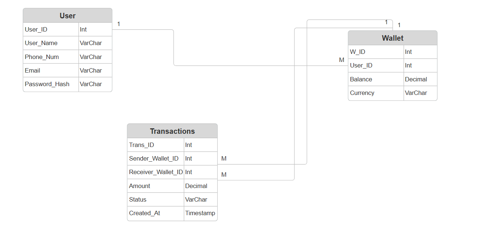

# Zync-app
all-in-one digital financial hub, built for speed and simplicity.
# Zync - Digital Wallet Backend

This is the backend service for Zync, built with Node.js, Express, and Sequelize (MySQL).

## Database Architecture
Below is the Entity-Relationship Diagram (ERD) mapping the core structure of the Zync database, ensuring strict data consistency for financial transactions.

